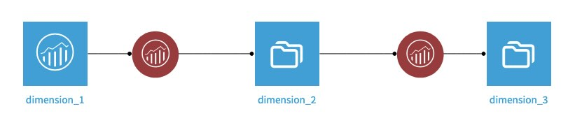

# Dataiku Adobe Analytics plugin

This plugin is under development.

## How to install

### On Adobe Analytics' side

1. Find the global company ID for your account, as explained on [Adobe documentation](https://experienceleague.adobe.com/en/docs/analytics/admin/admin-tools/company-settings/web-services-admin)
2. [Get an Adobe Analytic API key](https://developer.adobe.com/analytics-apis/docs/2.0/guides/)
3. [Create a client ID and client secret](https://developer.adobe.com/developer-console/docs/guides/credentials/#oauth-user-authentication)

### On Dataiku DSS side

As a Dataiku DSS admin:
- Install the plugin
    - by going to **Other sections** > **Plugins** > **Add Plugin** > **Fetch from GIT repository** and add **https://github.com/alexbourret/dss-plugin-adobe-analytics** in **Repository URL**, 
    - or update by downloading the latest [zip file from here](https://github.com/alexbourret/dss-plugin-adobe-analytics/releases), then **Other sections** > **Plugins** > **Add Plugin** > **Upload**, make sure **This is an update for an installed plugin** is ticked, and browse to the downloaded zip's path. 
- Create a preset, by clicking on **Other sections** > **Plugins** > **Installed** > **Adobe Analytics** > **Settings** > **OAuth Server-to-Server** > **+ Add preset**.
- Name the preset, add the client ID and client secret produced on step 3
- Add the company ID retrieved on step 1
- Add the API key produced on step 2
- Add the scopes. These would typically be `openid,AdobeID,additional_info.projectedProductContext,additional_info.job_function,offline_access`. The list of scopes available to a credential can be found [here](https://developer.adobe.com/console/). 
- Select the groups for which the preset can be used

## How to use

In a Dataiku flow, add a dataset + Dataset > Plugins > Adobe Analytics > Get Reports

- Select the preset created in section 2.
- Once the preset selected and provided the credentials are valid, the list of report suite should appear after a few seconds. Select one of interest.
- Based on the selected report suite, the metrics / Dimensions / Segments should be filled in. Select the appropriate one for the report you are building.
- Set the beginning and end dates
- Press **Test & Get Schema**

In cases where the number of report suites, metrics, dimensions or segments is too large to be comfortably displayed in the dataset's selectors, another dataset can be used to retrieve the list of all these elements. To do this:

- In a Dataiku flow, add a dataset + Dataset > Plugins > Adobe Analytics > List IDs
- Select the preset created in section 2.
- Select the type of ID of interest
- Paste the report suite ID if necessary
- Press **Test & Get Schema**

Each of these lists contains more details than what is displayed in the selectors. Once the element(s) of interest is identified, copy the row entry from the **id** column. Then, in the **Get Reports** dataset, select "**✍️ Enter manually**" and paste the element's id in the id box.

### Dimension breakdown recipe

The plugin also provides a recipe: **Recipe > Plugins > Adobe Analytics > Dimension Breakdown**.

Use it when you need a second-level dimension breakdown from a first-level Adobe report:

- Build an input dataset with **Get Reports**
- Enable **Add a breakdown column** in that dataset configuration
- Run the **Dimension Breakdown** recipe on this dataset
- Select the target dimension to break down by
- Repeat the operation for the next dimensions

The recipe reuses the report context (`report_id`, date range, metrics, source dimension and segment) from the input dataset and calls Adobe Analytics v2 breakdown queries for each input row.
